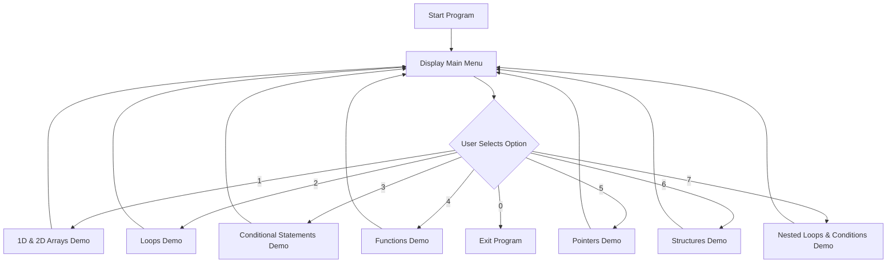
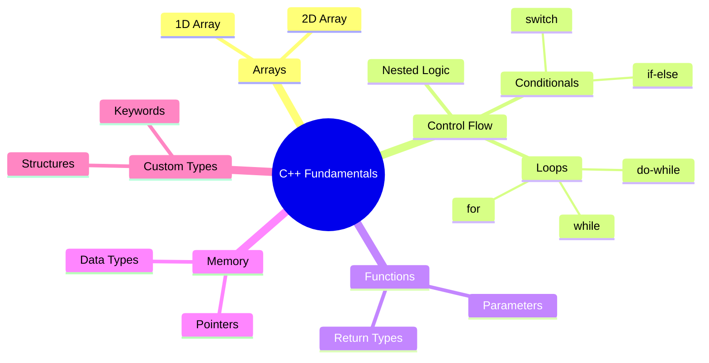

# CPP-Concepts-Hub
A menu-driven C++ console application showcasing core programming fundamentals — arrays, loops, conditionals, functions, pointers, and structures. Built as a hands-on learning project during my BS in AI to strengthen my grasp of foundational concepts through practical implementation.
# 🚀 C++ Programming Fundamentals Showcase

A menu-driven C++ console application demonstrating core programming concepts — built as a hands-on project to strengthen fundamentals during my BS in AI.


## 📖 Overview

This project is an interactive, menu-based console application where each menu option demonstrates a specific programming concept in isolation. It was built to reinforce core CS fundamentals through practical implementation rather than theory alone.

## ✨ Features / Concepts Covered

- 📊 1D and 2D Arrays
- 🔁 Loops — `for`, `while`, `do-while`
- 🔀 Conditional Statements — `if`, `else if`, `switch`
- 🧩 Functions (with parameters & return types)
- 📍 Pointers
- 🏗️ Structures (`struct`)
- 🔢 Data Types
- 🗝️ Keywords (`const`, `static`, etc.)
- 🌀 Nested Loops & Nested Conditions

## 🗂️ Project Flow



## 🧠 Concept Map



## 🛠️ Tech Stack

- **Language:** C++
- **Compiler:** GCC / g++
- **IDE:** VS Code / Code::Blocks

## ⚙️ How to Run

```bash
# Clone the repository
git clone https://github.com/<your-username>/CPP-Fundamentals-Showcase.git
cd CPP-Fundamentals-Showcase

# Compile
g++ main.cpp -o menu

# Run
./menu        # Linux/Mac
menu.exe      # Windows
```

## 📸 Sample Output

```
==================================
   C++ FUNDAMENTALS MENU
==================================
1. Arrays (1D & 2D)
2. Loops
3. Conditional Statements
4. Functions
5. Pointers
6. Structures
7. Nested Loops & Conditions
0. Exit
==================================
Enter your choice: 
```

## 🎯 What I Learned

- Structuring a multi-feature C++ program around a single control flow
- Practical use of pointers and memory referencing
- Designing reusable functions for cleaner, modular code
- Working with structs to model real-world data

## 📌 Future Improvements

- [ ] Add file handling (read/write)
- [ ] Add OOP concepts (classes, inheritance, polymorphism)
- [ ] Add exception handling
- [ ] Unit tests for each module

## 🤝 Connect With Me

I'm a BS in AI student actively exploring **internship / part-time / full-time** opportunities in AI & software development. Feel free to connect or reach out!

- LinkedIn: [your-linkedin-link]
- Email: [your-email]

## 📄 License

This project is licensed under the MIT License.
